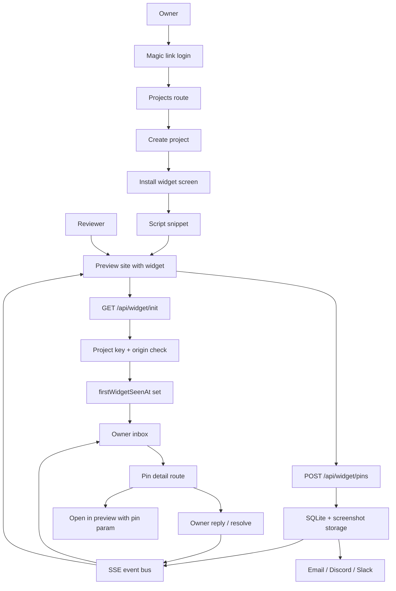

# Core v1 Launch Hardening

## Summary

Tack Core is already past the raw build stage: the app has install, inbox, pin detail, settings, SSE, SMTP, rate limiting, Docker, and widget anchoring primitives in place. The next Core step is a launch-hardening pass that makes the open-source feedback loop credible end to end: first install, first pin, owner triage, reply, resolve, open in preview, and self-host deployment.

This plan keeps AI Inbox as an adjacent paid/hosted layer and keeps Git preview workspaces, branches, PRs, and preview approval in Tack Ship.

---

## Problem Frame

The product direction says Core must be an OSS-complete website feedback loop, not a thin demo for later AI and Git automation. Current code and the older Core checklist disagree in a few places: several items marked "to build" are now present, while launch-sensitive details still need tightening around origin enforcement, onboarding edge cases, placement truth, demo behavior, and verification.

Core should now move from "features exist" to "we can confidently give this to an agency or self-hoster and have the first feedback session work without hand-holding."

---

## Requirements

**Owner Setup and Self-Host**

- R1. A fresh owner reaches create project, install widget, connected or continue, and inbox exactly once; accounts with stale `onboardingCompletedAt` state do not get stranded.
- R2. Install connection is recorded only after a successful widget init from an origin that matches the project's `previewUrl` rules.
- R3. Returning owners creating a new project can skip install verification without changing the original onboarding state machine.
- R4. Docker self-host works with persisted SQLite and screenshots, runs migrations on boot, and documents the Mailpit SMTP path for local verification.
- R5. The public demo route never ships with a placeholder project key; hosted demo is enabled only when configured, and self-host deployments fall back to a static README demo asset.

**Feedback Loop**

- R6. Reviewers can create pins with screenshots, element metadata, normalized URL, reviewer identity, first comment, and clear error states.
- R7. Reviewers can view, edit, delete their own pins, and reply from the widget without page refresh.
- R8. Owners can triage from inbox to a real pin detail route with screenshot marker, full thread, status actions, copyable links, and open-in-preview.
- R9. Dashboard and widget receive live pin and reply updates through SSE and recover missed events by refetching on reconnect.
- R10. Pin placement is understandable across surfaces: anchored when selector or tack id resolves, approximate when fallback anchors are used, and lost when a previously known anchor cannot be resolved.
- R11. URL matching is shared and deterministic: strip hashes and tracking params, normalize paths, default to pathname-only matching, and keep only project-configured query keys.

**Security and Reliability**

- R12. Widget endpoints enforce project key validity, project origin rules, rate limits, input validation, safe JSON parsing, and bounded screenshot handling.
- R13. Dashboard server functions remain tenant-scoped by `userId` and rate-limited by session.
- R14. Magic links and notifications use one email provider path: Resend when configured, SMTP when configured, console fallback in development.
- R15. Discord and Slack webhook payloads use provider-correct request shapes and record send failures without breaking the user action.

**Launch Consistency**

- R16. Core docs, app README, and launch checklist reflect the real implementation state and no longer mark unverified behavior as complete.
- R17. Automated tests cover the launch-critical helpers and server behavior, while manual acceptance covers the full owner/reviewer loop in the browser.

---

## Key Technical Decisions

- KTD1. Core hardening before new product surface: finish the OSS feedback loop before adding Git connection UI, PR creation, hosted sandboxes, or preview approval controls.
- KTD2. Keep the single-app architecture: TanStack Start continues to serve dashboard, server functions, widget API, static widget bundle, migrations, and self-host runtime.
- KTD3. Treat SQLite, in-memory SSE, and in-memory rate limiting as valid Core v1 self-host infrastructure: Redis/Postgres belong to hosted multi-instance hardening, not this Core pass.
- KTD4. Enforce origin rules at the widget API boundary: `corsHeaders` should stop reflecting every origin by default for project-scoped widget endpoints, and wrong origins should not read or mutate project feedback.
- KTD5. Make widget runtime the source of live placement truth: dashboard metadata can infer confidence, but true `lost` state requires the widget to report the result of resolving anchors on the actual preview page.
- KTD6. Keep connection status as dashboard-owned behavior: server functions are acceptable for the owner install screen, while widget REST endpoints remain public project-key APIs.
- KTD7. Keep Ship as a future layer: Core may preserve useful fields for later implementation briefs and open-in-preview links, but it must not create Git branches, write GitHub data, or deploy code.

---

## High-Level Technical Design

The app remains one deployable container. Widget calls are public and project-key scoped. Dashboard calls are owner-session scoped. Both write through the same Drizzle schema and emit the same in-memory event stream in Core v1.

---

## Implementation Units

### U1. Onboarding and Install Correctness

- **Goal:** Make first-run setup reliable for new and returning owners.
- **Files:** `apps/web/src/routes/projects/index.tsx`, `apps/web/src/routes/projects/new.tsx`, `apps/web/src/routes/projects/$id/install.tsx`, `apps/web/src/lib/user.ts`, `apps/web/src/lib/projects.ts`, `apps/web/src/lib/widget-connection.ts`, `apps/web/src/routes/api/widget/init.ts`.
- **Work:** Fix onboarding search parsing so boolean and string values both work; handle users with projects but null `onboardingCompletedAt`; keep connected and continue-anyway semantics separate; keep install skip visible for non-onboarding project creation; make wrong-origin connection errors explicit on install.
- **Tests:** Add route/helper coverage for onboarding redirect decisions, install search parsing, and `previewOriginMatches`.
- **Verification:** Fresh login with no projects enters onboarding, connected widget sets completion, continue-anyway works after timeout, returning owner new project can skip to inbox.

### U2. Widget API Origin, CORS, and Input Hardening

- **Goal:** Make public project-key endpoints safe enough for an OSS launch.
- **Files:** `apps/web/src/lib/cors.ts`, `apps/web/src/lib/rate-limit.ts`, `apps/web/src/lib/storage.ts`, `apps/web/src/routes/api/widget/init.ts`, `apps/web/src/routes/api/widget/pins.ts`, `apps/web/src/routes/api/widget/pins/$pinId.ts`, `apps/web/src/routes/api/widget/pins/$pinId/replies.ts`, `apps/web/src/routes/api/widget/events.ts`.
- **Work:** Replace permissive origin reflection with project-aware allowed origins, including the documented wildcard-subdomain rule; enforce origin checks consistently before returning pins or accepting mutations; return stable 400s for malformed JSON; bound screenshot payload size and type; ensure OPTIONS handling is consistent where browser preflight can happen.
- **Tests:** Cover wrong-origin init, wrong-origin pin create, valid preview origin, wildcard subdomain origin, malformed body, oversized screenshot, and widget rate limit `Retry-After`.
- **Verification:** A copied project key cannot create pins from an unrelated origin; local dev remains workable when preview URL is localhost.

### U3. Pin Detail and Inbox Triage Completion

- **Goal:** Make D1 to D2 feel like a finished owner workflow rather than a debug view.
- **Files:** `apps/web/src/routes/projects/$id/inbox.tsx`, `apps/web/src/routes/projects/$id/pins/$pinId.tsx`, `apps/web/src/components/PinRow.tsx`, `apps/web/src/components/PinDetail.tsx`, `apps/web/src/lib/project-pin-actions.ts`, `apps/web/src/lib/pin-display.ts`.
- **Work:** Keep inbox rows focused on triage and route navigation; preserve status filters on back navigation; add copy link action; show `tackId`, XPath, selector, viewport, screenshot availability, and placement confidence in detail; ensure open-in-preview builds clean URLs for trailing-slash preview URLs.
- **Tests:** Cover `buildPreviewLink`, pin detail data mapping, filter preservation behavior, and status updates emitting events.
- **Verification:** Owner can open a pin, inspect context, copy a dashboard link, open preview at the pinned location, reply, resolve, reopen, and return to the same filtered inbox.

### U4. Placement and URL Normalization Reliability

- **Goal:** Turn current anchoring helpers into a consistent cross-surface contract.
- **Files:** `packages/shared/src/url.ts`, `packages/shared/src/placement.ts`, `packages/widget/src/lib/placement.ts`, `packages/widget/src/components/PinOverlay.tsx`, `packages/widget/src/index.tsx`, `apps/web/src/lib/placement-display.ts`, `apps/web/src/db/schema.ts`.
- **Work:** Expand URL normalization for duplicate slashes, hashes, and common tracking params; add shared tests in `packages/shared`; add persisted placement fields if dashboard needs true `lost` state; have the widget report resolved placement after init or reload; make dashboard labels honest when placement data is stale or inferred.
- **Tests:** Cover hash stripping, tracking params, query allowlist, root/trailing slash behavior, selector success, XPath fallback, coordinate fallback, and lost anchor reporting.
- **Verification:** Pins stay attached after small DOM changes, fall back visibly when anchors weaken, and show a lost indicator only when the widget has actually failed to resolve a known anchor.

### U5. Realtime and Notifications Polish

- **Goal:** Make live collaboration and notifications dependable without adding a job queue.
- **Files:** `apps/web/src/lib/events.ts`, `apps/web/src/routes/api/projects/$id/events.ts`, `apps/web/src/routes/api/widget/events.ts`, `packages/widget/src/lib/api.ts`, `apps/web/src/lib/email.ts`, `apps/web/src/lib/notifications.ts`, `apps/web/src/routes/api/auth/send-magic-link.ts`.
- **Work:** Confirm all pin, reply, edit, delete, resolve, and reopen paths emit the right event; make reconnect behavior refetch authoritative state; fix Discord versus Slack payload shape; keep notification failures logged in `notifications`; keep magic-link response enumeration-safe under rate limits.
- **Tests:** Cover event stream formatting, widget reconnect callback, notification payload construction, SMTP/Resend/console provider choice, and magic-link rate limiting.
- **Verification:** Reviewer pin appears in owner inbox without refresh; owner reply appears in widget thread after SSE/refetch; failed webhook does not block pin creation.

### U6. Self-Host, Demo, and Documentation Cleanup

- **Goal:** Make the OSS distribution easy to trust and easy to try.
- **Files:** `README.md`, `Dockerfile`, `docker-compose.yml`, `docker-compose.dev.yml`, `docker-entrypoint.sh`, `scripts/smoke-docker.sh`, `apps/web/src/routes/demo.tsx`, `docs/demo.svg`.
- **Work:** Audit Docker build/start from a clean checkout; keep migration boot path documented; make `/demo` read `TACK_DEMO_PROJECT_KEY` instead of hardcoded placeholders or disable the widget when unset; replace or clearly label the SVG demo asset; align README claims with verified Core behavior.
- **Tests:** Extend Docker smoke checks beyond `/login` and `tack-widget.js` if practical, including migration boot and Mailpit configuration.
- **Verification:** `docker compose up --build` reaches login, serves the widget, persists data under `/data`, and documents how to see magic links locally.

### U7. Launch Test Matrix and Spec Alignment

- **Goal:** Make the Core launch bar executable and keep product docs from drifting again.
- **Files:** `apps/web/src/lib/launch-checklist.test.ts`, `apps/web/src/lib/rate-limit.test.ts`, `apps/web/src/lib/ai/*.test.ts`, `packages/shared/src/*.test.ts`, `apps/web/src/routes/**/*.test.tsx`, `docs/plans/2026-06-01-001-feat-core-v1-launch-hardening-plan.md`.
- **Work:** Add focused unit and server-function tests for the requirements above; add a manual browser acceptance checklist for owner setup, reviewer feedback, reply, resolve, open-in-preview, wrong-origin, and Docker; update the Core checklist only after behavior is verified.
- **Tests:** Keep fast unit tests for helpers; add route/server tests where auth, tenant scope, origin, or persistence decisions matter; use browser smoke for the full loop.
- **Verification:** A future implementer can run the checklist and know exactly which Core behaviors are launch-ready.

---

## Acceptance Examples

- AE1. Given a new email signs in for the first time, when the owner creates a project and the widget loads once from the configured preview origin, then `firstWidgetSeenAt` and `onboardingCompletedAt` are set and the owner lands in the inbox.
- AE2. Given the same project key is embedded on an unrelated origin, when the widget calls init or create pin, then no pins are returned or created and the response explains the preview URL mismatch.
- AE3. Given a page URL `/pricing/?utm_source=x&tab=plans#hero` and project `pinQueryParams` contains `tab`, when a pin is created, then the stored URL is `/pricing?tab=plans`.
- AE4. Given a pin was created with a selector and XPath, when the selector no longer resolves but XPath does, then the widget shows the pin as approximate and the dashboard does not call it anchored.
- AE5. Given a reviewer creates a pin while the owner has the inbox open, when the SSE event arrives, then the inbox refetches and shows the new pin without manual refresh.
- AE6. Given Docker Compose starts with Mailpit overlay, when the owner requests a magic link, then the login email appears in Mailpit and no Resend key is required.

---

## Scope Boundaries

**In scope for Core**

- Widget feedback capture, screenshots, element metadata, replies, owner dashboard triage, install verification, self-host packaging, notifications, security hardening, and launch docs.

**Deferred to AI Inbox**

- Manual AI pin analysis, labels, summaries, duplicate groups, implementation briefs, OpenAI cost caps, and hosted AI packaging.

**Deferred to Tack Ship**

- Git connection, repository cloning, Git preview workspaces, sandboxed code edits, branches, GitHub PR creation, PR status sync, preview approval, and any MCP export flow.

**Outside the product identity**

- Reviewer-triggered production deploys, automatic merges, production database cloning, and hidden code changes without owner review.

---

## System-Wide Impact

This pass touches every Core boundary: public widget API, owner auth paths, shared URL and placement semantics, screenshot storage, notification delivery, SSE refresh behavior, Docker runtime, and product docs. The riskiest behavior change is tightening widget origin checks because it can expose preview URL misconfiguration that the current permissive CORS behavior masks.

If persisted placement state is added, it requires one Drizzle migration and a backward-compatible default for existing pins.

---

## Risks & Dependencies

| Risk | Impact | Mitigation |
|---|---|---|
| Origin enforcement breaks local or bookmarklet workflows | Owners may think install failed | Support explicit localhost preview URLs, clear mismatch messages, and troubleshooting copy on install |
| In-memory SSE and rate limits do not scale across instances | Hosted multi-instance behavior can miss events or limits | Keep this acceptable for Core self-host; move Redis/Postgres to hosted hardening |
| Placement `lost` state can become stale | Dashboard may imply current DOM state from old widget data | Store `placementCheckedAt` or label inferred states clearly |
| Docker image drifts from local dev | Self-host first impression fails | Keep `scripts/smoke-docker.sh` and README commands aligned with the Dockerfile |
| Slack and Discord webhook APIs differ | Notifications fail silently or record noisy failures | Unit-test provider payload construction separately |
| Core checklist becomes aspirational again | Future work starts from false confidence | Only mark checklist items complete after tests or manual acceptance evidence |

---

## Documentation / Operational Notes

The README should speak to self-hosters first: run Docker, configure SMTP, embed widget, get first pin. Product docs should keep the three-layer language clear:

- Tack Core: OSS feedback loop.
- Tack AI Inbox: manual analysis and implementation briefs.
- Tack Ship: Git preview workspace and PR flow, private beta.

Core docs should mention that Git connection sounds right for the larger product, but it is not part of the Core launch path.

---

## Sources / Research

- `apps/web/src/db/schema.ts` shows Core schema fields already present for users, projects, pins, replies, notifications, AI, and sessions.
- `apps/web/src/routes/projects/$id/install.tsx` contains the current install polling and onboarding completion behavior.
- `apps/web/src/routes/projects/$id/pins/$pinId.tsx` and `apps/web/src/components/PinDetail.tsx` contain the routed pin detail baseline.
- `apps/web/src/routes/api/widget/init.ts`, `apps/web/src/routes/api/widget/pins.ts`, and `apps/web/src/lib/widget-connection.ts` define current widget init, pin creation, URL normalization use, and preview-origin matching.
- `packages/widget/src/lib/element-id.ts`, `packages/widget/src/lib/placement.ts`, and `packages/widget/src/components/PinOverlay.tsx` contain current `@medv/finder`, XPath, and placement resolution behavior.
- `apps/web/src/lib/events.ts`, `apps/web/src/routes/api/projects/$id/events.ts`, and `apps/web/src/routes/api/widget/events.ts` contain the current in-memory SSE implementation.
- `apps/web/src/lib/email.ts`, `apps/web/src/lib/notifications.ts`, and `apps/web/src/routes/api/auth/send-magic-link.ts` contain current email, webhook, notification, and magic-link behavior.
- `Dockerfile`, `docker-compose.yml`, `docker-compose.dev.yml`, `docker-entrypoint.sh`, and `scripts/smoke-docker.sh` contain the current self-host packaging baseline.
